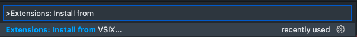
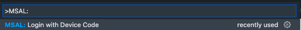
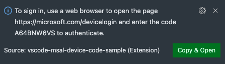

# MSAL Device Code Sample for VS Code

## Running the Sample

1. Download the [vsix]() and install it in VS Code by opening the [command palette](https://code.visualstudio.com/docs/getstarted/userinterface#_command-palette) and running the "Extensions: Install from VSIX..." command.

	

2. Run the "MSAL: Login with Device Code" command. A notification will appear with further instructions.

	
	

3. Follow the instructions in your browser to complete the auth flow.
